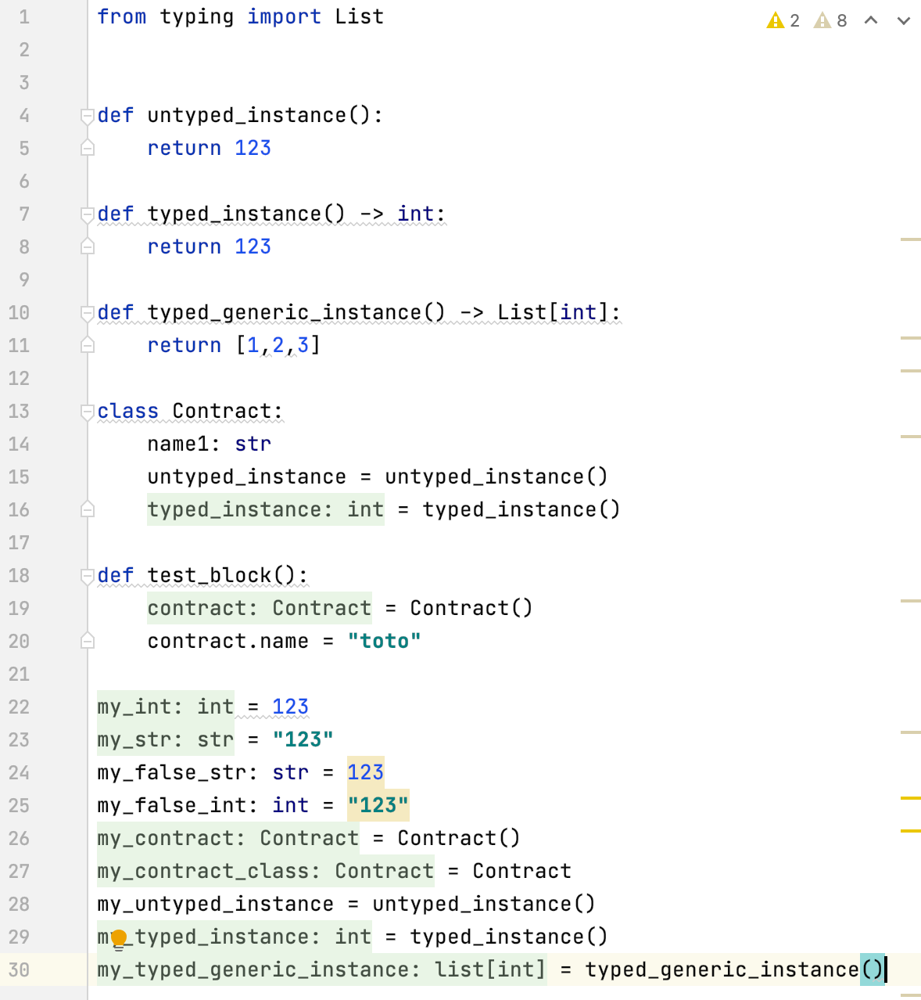
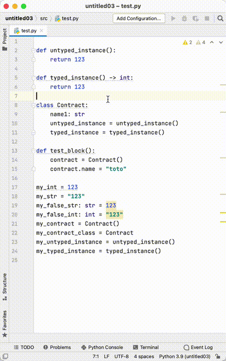

# Python Inlay Hints Plugin

## Description

<!-- Plugin description -->
Show inferred Python types as Inlay Hints using folds (while we wait for [Displaying inlay hints for inferred types](https://youtrack.jetbrains.com/issue/PY-45743)).
<!-- Plugin description end -->

| Python Inlay Hints in folds                                                            | Python Inlay Hints Demo                                                       | 
|----------------------------------------------------------------------------------------|-------------------------------------------------------------------------------|
|  |  |

## Usage

Showing and hiding types is done using the default folding commands:

- **Show all the types**
    - "Collapse All" (**Normal:** <kbd>ctrl</kbd> + <kbd>shift</kbd> + <kbd>-</kbd>, **Mac:** <kbd>cmd</kbd> + <kbd>shift</kbd> + <kbd>-</kbd>)
    - "Uncollapse All" (**Normal:** <kbd>ctrl</kbd> + <kbd>shift</kbd> + <kbd>+</kbd>, **Mac:** <kbd>cmd</kbd> + <kbd>shift</kbd> + <kbd>+</kbd>)
- **Hide all the types**
    - "Uncollapse All" (**Normal:** <kbd>ctrl</kbd> + <kbd>shift</kbd> + <kbd>+</kbd>, **Mac:** <kbd>cmd</kbd> + <kbd>shift</kbd> + <kbd>+</kbd>)

## TODO

- [ ] [Move to multi-module](https://plugins.jetbrains.com/docs/intellij/plugin-compatibility.html#modules-specific-to-functionality) (intellij has python plugin as well)
- [ ] https://github.com/JetBrains/intellij-sdk-code-samples
